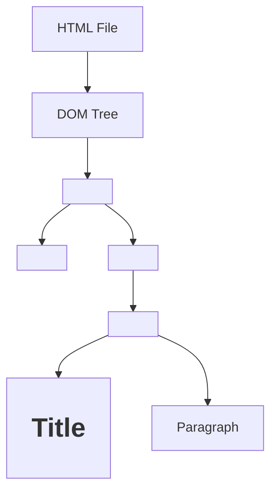

# 🚀 React JS Learning Notes  
**By Rishabh Umredkar**

---
## 📑 Index

### Day 1: Getting Started with React  
1. [Getting Started with React](#-day-1-getting-started-with-react)  
    1.1. [Why Use React?](#-why-use-react)  
2. [JavaScript Modules: Export & Import](#-javascript-modules-export--import)  
    2.1. [Basic Export & Import](#-basic-export--import)  
    2.2. [Scenario 1: Exporting & Importing Functions](#-scenario-1-exporting--importing-functions)  
    2.3. [Scenario 2: Exporting Multiple Values](#-scenario-2-exporting-multiple-values)  
        2.3.1. [Exporting Multiple Values as an Array](#-21-exporting-multiple-values-as-an-array)  
        2.3.2. [Exporting Multiple Values as an Object](#-22-exporting-multiple-values-as-an-object)  
3. [Summary](#-summary)  

### Day 3: React Concepts & Q&A  
4. [React Concepts & Q&A](#-day-3-react-concepts--qa)  
    4.1. [Q1. Advantages and Disadvantages of React](#-q1-what-are-the-advantages-and-disadvantages-of-react)  
    4.2. [Q2. SPA vs MPA](#-q2-difference-between-single-page-application-spa-and-multiple-page-application-mpa)  
    4.3. [History of Popular Frontend Frameworks](#-history-of-popular-frontend-frameworks)  
    4.4. [Q3. What is the Diffing Algorithm?](#-q3-what-is-the-diffing-algorithm)  
    4.5. [Q4. What is Reconciliation?](#-q4-what-is-reconciliation)  
    4.6. [Q5. What is React Fiber?](#-q5-what-is-react-fiber)  
    4.7. [Real DOM Diagram](#-real-dom-diagram)  

### Day 4: Frameworks vs Libraries in JavaScript  
5. [Frameworks vs Libraries in JavaScript](#-day-4-frameworks-vs-libraries-in-javascript)  
    5.1. [Difference Between Frameworks and Libraries](#-difference-between-frameworks-and-libraries)  
    5.2. [Q&A: Framework vs Library](#-qa-framework-vs-library)  

### Day 5: AJAX, Package Bundlers, and Project Structure  
6. [AJAX, Package Bundlers, and Project Structure](#-day-5-ajax-package-bundlers-and-project-structure)  
    6.1. [What is AJAX?](#-what-is-ajax)  
    6.2. [Q&A: AJAX](#-qa-ajax)  
    6.3. [What is a Package Bundler?](#-what-is-a-package-bundler-eg-rollup-webpack)  
    6.4. [Q&A: Package Bundlers](#-qa-package-bundlers)  
    6.5. [What is Bandwidth?](#-what-is-bandwidth)  
    6.6. [Typical React Project Structure & Key Files](#-typical-react-project-structure--key-files)  
    6.7. [Q&A: Project Structure](#-qa-project-structure)  

### Day 7: React Components & State  
7. [React Components & State](#-day-7-react-components--state)  
    7.1. [What is a Component?](#-what-is-a-component)  
    7.2. [What is a Module?](#-what-is-a-module)  
    7.3. [What is State?](#-what-is-state)  
    7.4. [Q&A: Function-based vs Class-based Components](#-qa-function-based-vs-class-based-components)  
    7.5. [Example: Class-based Component with State](#-example-class-based-component-with-state)  
    7.6. [Common Interview Questions](#-common-interview-questions)  

### Day 8: JSX Introduction  
8. [JSX Introduction](#-day-8-jsx-introduction)  
    8.1. [What is JSX?](#-what-is-jsx)  
    8.2. [Typical File Structure](#-typical-file-structure)  
    8.3. [JSX Rules & Best Practices](#-jsx-rules--best-practices)  
    8.4. [Q&A](#-q--a)  

### Day 9: State & useState Hook  
9. [State & useState Hook in React](#-day-9-state--usestate-hook-in-react)  
    9.1. [What is State in React?](#-what-is-state-in-react)  
    9.2. [What are Hooks?](#-what-are-hooks)  
    9.3. [useState Hook: Introduction](#-usestate-hook-introduction)  
    9.4. [Example: Basic useState Usage](#-example-basic-usestate-usage)  
    9.5. [Common Mistake: Not Using useState](#-common-mistake-not-using-usestate)  
    9.6. [Multiple State Updates](#-multiple-state-updates)  
    9.7. [Example: Counter with Increment, Decrement, and Reset](#-example-counter-with-increment-decrement-and-reset)  
    9.8. [Example: Show/Hide with useState](#-example-showhide-with-usestate)  
    9.9. [Q&A: State and useState Hook](#-qa-state-and-usestate-hook)  

---

## 📅 Day 1: Getting Started with React

### 🌟 Why Use React?

React is a powerful JavaScript library for building **user interfaces**, especially **Single Page Applications (SPAs)**. In SPAs, the entire app runs on a single HTML page, updating content dynamically **without reloading**—making your apps fast and seamless!

> **Famous SPAs:**  
> Instagram • Facebook • GitHub

---

## 📦 JavaScript Modules: Export & Import

JavaScript modules help you organize your code by splitting it into separate files. You can **export** variables, functions, or objects from one file and **import** them into another.

---

### ✨ Basic Export & Import

**Exporting a value:**

```js
// India.js
let phone = "IPhone";
export default phone;
```

**Importing the value:**

```js
import phone from "./India.js";
console.log(phone); // Output: IPhone
```

---

### 🛠️ Scenario 1: Exporting & Importing Functions

- With `export default`, you can export a function and import it using **any name**.

**Exporting a function:**

```js
// India.js
let phone = () => {
    console.log("IPhone");
};
export default phone;
```

**Importing with a different name:**

```js
import Lava from "./India.js";
Lava(); // Output: IPhone
```

---

### 🧩 Scenario 2: Exporting Multiple Values

You **can't** export multiple values directly with `export default`.  
Instead, group them in an **array** or **object**.

#### 2.1. Exporting Multiple Values as an Array

**Exporting:**

```js
// India.js
let phone = () => {
    console.log("IPhone");
};
let Laptop = "AsusX515";
export default [phone, Laptop];
```

**Importing:**

```js
import Resourse from "./India.js";
let [phone, Laptop] = Resourse;
console.log(Laptop); // Output: AsusX515
phone(); // Output: IPhone
```

#### 2.2. Exporting Multiple Values as an Object

**Exporting:**

```js
// India.js
let resourse1 = "Weapons";
let resourse2 = "Crude Oil";

let obj = {
    resourse1,
    resourse2,
    func: () => {
        console.log("Function");
    }
};
export default obj;
```

**Importing:**

```js
import India_Resourse from "./India.js";
let { resourse1, resourse2, func } = India_Resourse;
console.log(resourse2); // Output: Crude Oil
func(); // Output: Function
```

---

## 📝 Summary

- Use **`export default`** to export a single value (variable, function, array, or object).
- Import a default export with **any name**.
- To export multiple values, **group them** in an array or object.
- Use **destructuring** to access individual values after importing.

> 💡 **Interview Tip:**  
> "Use `export default` to export a single value (variable, function, array, or object) from a JavaScript module, and import it with any name in another file."

---
## 📅 Day 3: React Concepts & Q&A

### ❓ Q1. What are the Advantages and Disadvantages of React?

**Advantages:**
1. **Fast & Smooth Apps:** React uses a Virtual DOM, which updates only the parts of the UI that change. This makes apps highly responsive and efficient.
2. **Component Reusability:** You can build small, reusable components and combine them to create complex UIs, reducing code duplication.
2. **Code Reusability:** Encourages reuse of components, reducing redundancy.
3. **Rapid Development:** Component-based structure accelerates development.
4. **Easy Maintenance:** Modular code simplifies updates and maintenance.
5. **Lightweight Applications:** Efficient rendering keeps apps lightweight.

**Disadvantages:**
1. **SEO Limitations:** SPAs have limited SEO because only one HTML file is loaded, restricting meta tag updates.
2. **Higher Cost:** Requires skilled developers, potentially increasing project costs.

---

### ❓ Q2. Difference Between Single Page Application (SPA) and Multiple Page Application (MPA)

| Feature                | SPA (Single Page Application)                  | MPA (Multiple Page Application)             |
|------------------------|-----------------------------------------------|---------------------------------------------|
| **Page Loading**       | Loads a single HTML file; updates content dynamically | Loads a new HTML file for each page         |
| **Speed**              | Faster navigation after initial load           | Slower navigation due to full page reloads  |
| **SEO**                | Limited SEO support                           | Better SEO, as each page can have unique meta tags |
| **User Experience**    | Smooth, app-like experience                   | Traditional website feel                    |
| **Development**        | More complex routing, but easier state management | Simpler routing, but more code duplication  |

---

### 🏛️ History of Popular Frontend Frameworks

- **Angular (2009, Google):**  
    - Based on MVC architecture  
    - Supports JavaScript & TypeScript

- **React (2011, Facebook):**  
    - Component-based architecture  
    - Supports JavaScript & TypeScript  
    - Used by Instagram (2011), Facebook (2012), Officially launched (2013)

- **Vue (2014, Evan You):**  
    - Component-based architecture  
    - Supports JavaScript & TypeScript

- **Angular 2 (2016, Google):**  
    - Component-based architecture  
    - Supports only TypeScript

---

### ❓ Q3. What is the Diffing Algorithm?

The **diffing algorithm** is React's process for comparing the current Virtual DOM with the previous one to identify changes. It efficiently finds the differences between the Virtual DOM and the Real DOM, minimizing updates and improving performance.

It is the process of finding the Difference between Real DOM And Virtual DOM.


---

### ❓ Q4. What is Reconciliation?

**Reconciliation** is the process where React applies the changes found by the diffing algorithm to the Real DOM. This ensures only the necessary updates are made, making the UI fast and efficient.

Implementing the changes in Real DOM, that found during the Diffing Algorithm Virtual DOM.

---
### ❓ Q5. What is React Fiber?

**React Fiber** is the core engine of React responsible for handling its internal processes, such as the diffing algorithm, reconciliation, and rendering updates. It enables React to efficiently manage complex UI updates, prioritize tasks, and deliver smoother user experiences by breaking rendering work into smaller units.

---

### 🖼️ Real DOM Diagram
**real**
Below is a diagram illustrating the structure of the Real DOM:



**Explanation:**  
- The Real DOM is a tree-like structure representing the HTML elements of a page.
- Each HTML tag becomes a node in the DOM tree.
- React interacts with the Real DOM by updating only the parts that change, thanks to the Virtual DOM and reconciliation process.

---

## 📅 Day 4: Frameworks vs Libraries in JavaScript

### 📚 Difference Between Frameworks and Libraries

A **library** is a collection of pre-written code that helps you perform common tasks. You are in control: you decide when and how to use the library's functions.  
A **framework** provides a complete structure for your application. The framework is in control: it calls your code at specific points (this is called **Inversion of Control**).

#### 🔍 Key Differences

| Aspect                   | **Library**                                                     | **Framework**                                                  |
| ------------------------ | --------------------------------------------------------------- | -------------------------------------------------------------- |
| **Control**              | *You call the library functions.* You are in control.           | *Framework calls your code.* It controls the application flow. |
| **Inversion of Control** | ❌ No — You decide when and how to use it.                       | ✅ Yes — It decides when and how to use your code.              |
| **Purpose**              | Provides specific functionality (e.g., DOM manipulation, HTTP). | Provides a full structure to build SPA/MPA applications.       |
| **Flexibility**          | More flexible — Use only what you need.                         | Less flexible — Must follow the framework's conventions.       |
| **Examples (JS)**        | `jQuery`, `Lodash`, `Axios`, `Chart.js`, `React`                | `Angular`, `Vue`, `Next.js`, `Nuxt.js`, `SvelteKit`            |
| **Learning Curve**       | Usually easier to learn and plug into projects.                 | Higher — requires learning lifecycle, routing, CLI, etc.       |
| **Maintenance**          | Easier — fewer side effects, smaller scope.                     | Harder — tightly coupled components can cause side effects.    |
| **Real-World Role**      | Helps in **doing** something.                                   | Helps in **building** the whole app architecture.              |

---

### ❓ Q&A: Framework vs Library

**Q1. What is the main difference between a library and a framework?**  
A library is a set of tools you use as needed, while a framework provides the structure and calls your code (inversion of control).

**Q2. What is "Inversion of Control"?**  
It means the framework, not you, is in charge of the application's flow. Your code fills in the blanks.

**Q3. Is React a library or a framework?**  
React is officially a library (for building UIs), but with its ecosystem (React Router, Redux, etc.), it can behave like a framework.

**Q4. Why might you choose a library over a framework?**  
Libraries offer more flexibility and are easier to integrate into existing projects.

**Q5. Why might you choose a framework?**  
Frameworks provide a ready-made structure, enforce best practices, and speed up development for large applications.

---

> **Summary:**  
> Use a **library** when you want flexibility and control. Use a **framework** when you want a complete structure and are okay with following its rules.

---
## 📅 Day 5: AJAX, Package Bundlers, and Project Structure

### 🌐 What is AJAX?

**AJAX** stands for **Asynchronous JavaScript and XML**.  
It allows web applications to send and receive only the necessary data from the server **without reloading the entire page**. This makes web apps faster and more interactive.

- **Key Points:**
    - Enables partial page updates (no full reload).
    - Uses technologies like `XMLHttpRequest` or `fetch` API.
    - Can send/receive data in formats like JSON, XML, or plain text.

---

### ❓ Q&A: AJAX

**Q1. What does AJAX stand for?**  
Asynchronous JavaScript and XML.

**Q2. Why is AJAX important in modern web apps?**  
It allows updating parts of a web page without reloading, improving user experience and performance.

**Q3. What are common data formats used with AJAX?**  
JSON (most common), XML, plain text.

---

### 📦 What is a Package Bundler? (e.g., Rollup, Webpack)

A **package bundler** is a tool that collects all your project's files (JavaScript, CSS, images, etc.), resolves dependencies, and bundles them into a few optimized files for the browser or server to load.

- **Popular bundlers:** Webpack, Rollup, Vite, Parcel.
- **Why use a bundler?**
    - Reduces the number of files the browser needs to load.
    - Optimizes and minifies code for better performance.
    - Handles module imports/exports.

**Example:**  


---

### ❓ Q&A: Package Bundlers

**Q1. What is the main purpose of a package bundler?**  
To combine and optimize project files for efficient loading in browsers.

**Q2. Name some popular bundlers used in React projects.**  
Webpack, Rollup, Vite, Parcel.

**Q3. How do bundlers help with bandwidth?**  
They reduce the number and size of files sent over the network, saving bandwidth and speeding up load times.

---

### 📶 What is Bandwidth?

**Bandwidth** refers to the amount of data that can be transferred between the client and server per second (request-response cycles per second).

- Higher bandwidth = faster data transfer.
- Optimizing files and requests helps save bandwidth.

---

### 🗂️ Typical React Project Structure & Key Files

#### **index.html**
- Usually, there is **only one HTML file** in a React app (in the `public` folder).
- Contains:
    1. `<div id="root"></div>` — where your React app mounts.
    2. `<script type="module" src="./src/main.js"></script>` — loads your main JS bundle.

#### **node_modules/**
- Contains all installed dependencies (libraries, tools) for your project.
- Managed by npm/yarn.
- **Do not edit files here directly.**

#### **public/**
- Stores static assets (images, favicon, etc.).
- Usually, most assets are kept in `src/assets` for React projects.

#### **package.json**
- Lists project info: name, version, scripts, dependencies, devDependencies.
- **Dependencies:** Needed for the app to run.
- **DevDependencies:** Needed only during development (e.g., testing tools, bundlers).

#### **package-lock.json**
- Records the exact versions of installed packages in `node_modules`.
- Ensures consistent installs across environments.

#### **.gitignore**
- Lists files/folders Git should ignore (e.g., `node_modules`, build files).

#### **README.md**
- Contains documentation and description about the project.

#### **vite.config.js**
- Configuration file for Vite (if using Vite as a bundler).

#### **src/**
- Main source folder for your React app.
    ```
    src/
    ├── assets/      # Images, icons, etc.
    ├── App.jsx      # Main App component
    ├── App.css      # App styles
    ├── main.jsx     # Entry point for React
    └── index.css    # Global styles
    ```

---

### ❓ Q&A: Project Structure

**Q1. Why is there only one HTML file in a React app?**  
React is a Single Page Application (SPA) framework; all UI is rendered inside a single HTML file.

**Q2. What is the purpose of `node_modules`?**  
It stores all the dependencies required for your project.

**Q3. What is the difference between `dependencies` and `devDependencies` in `package.json`?**  
- `dependencies`: Needed for the app to run.
- `devDependencies`: Needed only during development.

**Q4. What does `.gitignore` do?**  
Tells Git which files/folders to ignore (not track in version control).

**Q5. Where should you store images and static assets in a React project?**  
Preferably in `src/assets/` for easy imports in components.

---

> **Summary:**  
> AJAX enables dynamic, fast web apps by updating only necessary data. Package bundlers like Webpack and Vite optimize and combine your code for efficient delivery. Understanding the React project structure helps you organize and maintain your codebase effectively.

---


## 📅 Day 7: React Components & State

### 🧩 What is a Component?

A **Component** is a reusable block of code in React that performs a specific task and represents a part of the UI.  
- Components can be functions or classes.
- The name of a component should always start with an **uppercase** letter.
- Components return JSX, which describes what should appear on the screen.
- Multiple components can exist in a single module, but it's recommended to have one main component per file.
- **Types of Components:**
    1. **Function-based Components (FBC)**
    2. **Class-based Components (CBC)**

---

### 📦 What is a Module?

A **Module** is a single JS or JSX file in React.
- A file becomes a module when it uses `type="module"` (in vanilla JS) or by using `import`/`export` in React.
- Modules allow you to organize code and share components using `import` and `export`.
- In React, modules typically have `.js` or `.jsx` extensions.
- You can have multiple components in one module, but best practice is one main component per file.

---

### 🔄 What is State?

**State** is a built-in object that stores property values that belong to a component.
- State allows components to create and manage dynamic data.
- Any update to the UI (like user input, clicks, etc.) should be handled through state.
- In class-based components, state is managed using `this.state` and updated with `this.setState()`.
- In function-based components, state is managed using **Hooks** like `useState`.

---

### ❓ Q&A: Function-based vs Class-based Components

| Feature                        | Function-based Component (FBC)                                                                 | Class-based Component (CBC)                                      |
|---------------------------------|----------------------------------------------------------------------------------------------|------------------------------------------------------------------|
| Syntax                         | Uses `function` or arrow function                                                            | Uses `class` and extends `Component`                             |
| Render Method                  | Returns JSX directly                                                                         | Must define a `render()` method                                  |
| State Management               | Uses Hooks (`useState`, `useReducer`, etc.)                                                  | Uses `this.state` and `this.setState()`                          |
| Lifecycle Methods              | Uses Hooks (`useEffect`) to mimic lifecycle methods                                          | Has built-in lifecycle methods (`componentDidMount`, etc.)        |
| Hooks Support                  | Yes                                                                                          | No                                                               |
| Code Maintenance               | Easier to maintain, less boilerplate                                                         | More boilerplate, harder to maintain                             |

---

#### Example: Class-based Component with State

```jsx
import { Component } from "react";

class Count extends Component {
    constructor() {
        super();
        this.state = {
            cartItem: 0
        };
    }

    render() {
        return (
            <div>
                <h1>{this.state.cartItem}</h1>
                <button onClick={() => {
                    this.setState({ cartItem: this.state.cartItem + 1 });
                }}>
                    Like
                </button>
            </div>
        );
    }
}

export default Count;
```

**Explanation:**
- `Count` is a class-based component.
- State is initialized in the constructor.
- The `Like` button updates the `cartItem` state using `setState`, causing the component to re-render.

---

### ❓ Common Interview Questions

**Q1. What is a component in React?**  
A reusable block of code that returns JSX and represents a part of the UI.

**Q2. What is the difference between a module and a component?**  
A module is a file (JS/JSX) that can contain one or more components. A component is a function or class that returns JSX.

**Q3. How do you manage state in class-based components?**  
By initializing `this.state` in the constructor and updating it with `this.setState()`.

**Q4. How do you manage state in function-based components?**  
By using React Hooks like `useState` and `useReducer`.

**Q5. What are lifecycle methods?**  
Special methods in class-based components (like `componentDidMount`, `componentDidUpdate`, `componentWillUnmount`) that run at specific points in a component's life.

**Q6. Why are function-based components preferred in modern React?**  
They are simpler, easier to maintain, and support Hooks for state and lifecycle management.

---

> **Summary:**  
> Components are the building blocks of React apps. Use state to manage dynamic data, and prefer function-based components with Hooks for cleaner, more maintainable code.

---


## 📅 Day 8: JSX Introduction

### 📝 What is JSX?

**JSX (JavaScript XML)** is a syntax extension for JavaScript, used with React to describe what the UI should look like. It allows you to write HTML-like code inside JavaScript, making UI code more readable and expressive.

---

### 📁 Typical File Structure

```
JSXIntro/
├── Task1.jsx
├── JSXIntro.jsx
├── App.jsx
└── main.jsx
```
- **Task1.jsx**: Contains a specific task or component.
- **JSXIntro.jsx**: Main file introducing JSX concepts.
- **App.jsx**: Root component.
- **main.jsx**: Entry point for rendering the app.

---

### 📜 JSX Rules & Best Practices

1. **Single Root Element:**  
    Each component must return only one JSX element. You can nest multiple elements inside a single parent.

    ```jsx
    // Correct
    return (
      <div>
         <h1>Hello</h1>
         <p>Welcome!</p>
      </div>
    );
    ```

2. **Element Naming:**
    JSX element always writtern in lowercase (UpperCase consider as Component)  
    - HTML elements: lowercase (`div`, `span`)
    - React components: Uppercase (`MyComponent`)

3. **Valid Nesting:** 
    Do not place invalid elements inside others (e.g., `<div>` inside `<p>` is not allowed).

4. **Self-Closing Tags:**  
    All tags must be closed, even if they are self-closing.

    ```jsx
    
    <input type="text" />
    ```

5. **Attribute Naming:**  
    - `class` → `className`
    - `for` → `htmlFor`

6. **JSX Expressions:**  
    Use `{}` to embed JavaScript expressions.
 We can use jsx expression `{}` for writing JS code inside jsx.
              1. we can write only ternary opertor as an conditional statement.
              2. we can write only the HOF(Looping statement) that can return anything eg. map/filter/Reduce etc. 
                    we can use forEach but it is not recommended because it cannot return anything.

    - **Conditional Rendering:** Only ternary operators are allowed directly in JSX.
      ```jsx
      {isLoggedIn ? <p>Welcome!</p> : <p>Please log in.</p>}
      ```
    - **Looping:** Use array methods like `map`, `filter`, or `reduce` to render lists.
      ```jsx
      {items.map(item => <li key={item.id}>{item.name}</li>)}
      ```
      Avoid `forEach` as it does not return a value.

7. **React Fragments:**  
    Use `<React.Fragment>` or shorthand `<>...</>` to group elements without adding extra nodes to the DOM.

    ```jsx
    return (
      <>
         <h1>Title</h1>
         <p>Description</p>
      </>
    );
    ```

    - Use empty fragments only if you don't need to set a `key` attribute.

8. **Releated Rule no 1.** : We can use react fragment to avoid extra nodes in Dom Tree.
              You can keep empty fragment only when key attribute is not required.

    ```jsx
    return (
    //Day 8
    <Fragment>
         <div>
            <JSXIntro/>
         </div>
    </Fragment>
    
    )
    ```


---

### ❓ Q&A

**Q1. What is JSX and why is it used in React?**  
JSX is a syntax extension that lets you write HTML-like code in JavaScript. It makes UI code easier to read and write, and React transforms it into JavaScript calls.

**Q2. Why must a component return a single root element?**  
React needs a single root to efficiently manage and update the DOM tree.

**Q3. How do you write JavaScript code inside JSX?**  
Wrap JavaScript expressions in `{}`. For example: `{user.name}` or `{items.map(...)}`.

**Q4. What are React Fragments and why use them?**  
Fragments let you group multiple elements without adding extra nodes to the DOM, keeping the DOM tree clean.

**Q5. What are some attribute name differences in JSX?**  
Use `className` instead of `class`, and `htmlFor` instead of `for`.

---

> **Summary:**  
> JSX makes React development intuitive by blending HTML and JavaScript. Follow the rules for valid JSX, use fragments to avoid unnecessary DOM nodes, and leverage expressions for dynamic content.

---

## 📅 Day 9: State & useState Hook in React

### 🧠 What is State in React?

**State** is a special built-in object in React that allows components to store and manage dynamic data. When state changes, React automatically re-renders the component to reflect the new data.

- State is **local** to a component.
- State makes components **interactive** and **dynamic**.
- In **class-based components**, state is managed with `this.state` and updated using `this.setState()`.
- In **function-based components**, state is managed using the `useState` **Hook**.

---

### ⚡ What are Hooks?

**Hooks** are special functions introduced in React 16.8 that let you "hook into" React features (like state and lifecycle methods) in function components.

- The most commonly used hook is `useState`.
- Hooks can only be used in **function components** (not in classes).
- All hooks start with the word `use` (e.g., `useState`, `useEffect`).

---

### 🏗️ useState Hook: Introduction

`useState` is a Hook that lets you add state to function components.

**Syntax:**
```js
const [state, setState] = useState(initialValue);
```
- `state`: The current state value.
- `setState`: Function to update the state.
- `initialValue`: The initial value of the state.

---

### 📝 Example: Basic useState Usage

```jsx
import { useState } from "react";

function Counter() {
    const [count, setCount] = useState(0);

    return (
        <div>
            <h1>{count}</h1>
            <button onClick={() => setCount(count + 1)}>Add</button>
        </div>
    );
}
```
- Clicking the button updates the state and re-renders the component.

---

### ⚠️ Common Mistake: Not Using useState

If you use a normal variable instead of state, React will **not** re-render the component when the value changes.

```jsx
function WrongCounter() {
    let count = 0;
    return (
        <>
            <h1>{count}</h1>
            <button onClick={() => { count = count + 1; }}>Add</button>
        </>
    );
}
```
- Here, the displayed count will **not** update because React doesn't know the value has changed.

---

### 🛠️ Multiple State Updates

You can have multiple state variables in a single component:

```jsx
const [count, setCount] = useState(0);
const [isVisible, setIsVisible] = useState(true);
```

---

### 🧩 Example: Counter with Increment, Decrement, and Reset

```jsx
import { Fragment, useState } from "react";

function Counter() {
    const [count, setCount] = useState(0);

    return (
        <Fragment>
            <h1>{count}</h1>
            <button onClick={() => setCount(count + 1)}>➕</button>
            <button onClick={() => setCount(count - 1)}>➖</button>
            <button onClick={() => setCount(0)}>Reset</button>
        </Fragment>
    );
}
```

---

### 👁️ Example: Show/Hide with useState

```jsx
import { useState } from "react";

function ShowHide() {
    const [visible, setVisible] = useState(false);

    return (
        <div>
            <button onClick={() => setVisible(!visible)}>
                {visible ? "Hide" : "Show"}
            </button>
            {visible && <p>This is a toggleable paragraph!</p>}
        </div>
    );
}
```

---

### ❓ Q&A: State and useState Hook

**Q1. What is state in React?**  
State is a built-in object that stores dynamic data in a component and triggers re-rendering when updated.

**Q2. What is the useState hook?**  
`useState` is a React Hook that allows function components to have state variables.

**Q3. Why can't we use normal variables for dynamic data in React?**  
Normal variables do not trigger re-renders. Only state changes (via `useState` or `setState`) cause React to update the UI.

**Q4. Can we have multiple useState hooks in one component?**  
Yes, you can use as many `useState` hooks as needed for different pieces of state.

**Q5. What happens if you update state directly (e.g., `count = count + 1`)?**  
Direct updates to state variables won't re-render the component. Always use the setter function (`setCount`).

---

> **Summary:**  
> Use the `useState` hook to manage dynamic data in function components. Always update state using the setter function to ensure React re-renders your component.

---