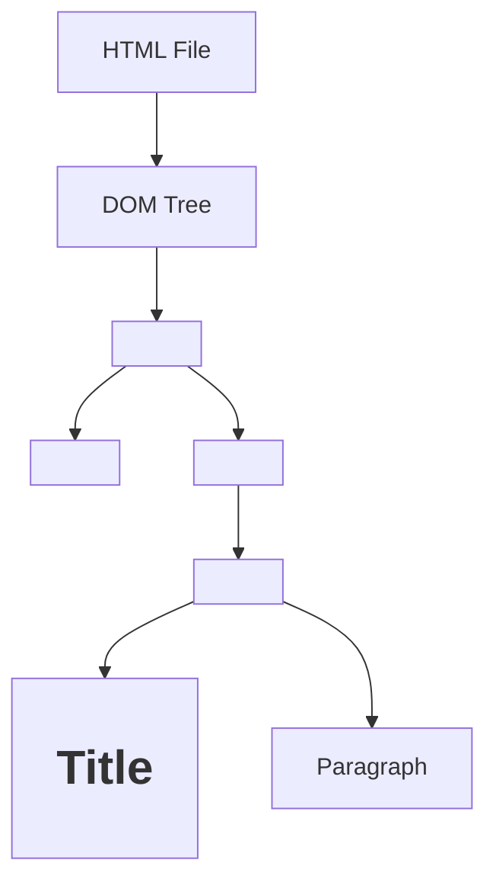

# 🚀 React JS Learning Notes  
**By Rishabh Umredkar**

---
## 📑 Index

### Day 1: Getting Started with React  
1. [Getting Started with React](#-day-1-getting-started-with-react)  
    1.1. [Why Use React?](#-why-use-react)  
2. [JavaScript Modules: Export & Import](#-javascript-modules-export--import)  
    2.1. [Basic Export & Import](#-basic-export--import)  
    2.2. [Scenario 1: Exporting & Importing Functions](#-scenario-1-exporting--importing-functions)  
    2.3. [Scenario 2: Exporting Multiple Values](#-scenario-2-exporting-multiple-values)  
        2.3.1. [Exporting Multiple Values as an Array](#-21-exporting-multiple-values-as-an-array)  
        2.3.2. [Exporting Multiple Values as an Object](#-22-exporting-multiple-values-as-an-object)  
3. [Summary](#-summary)  

### Day 3: React Concepts & Q&A  
4. [React Concepts & Q&A](#-day-3-react-concepts--qa)  
    4.1. [Q1. Advantages and Disadvantages of React](#-q1-what-are-the-advantages-and-disadvantages-of-react)  
    4.2. [Q2. SPA vs MPA](#-q2-difference-between-single-page-application-spa-and-multiple-page-application-mpa)  
    4.3. [History of Popular Frontend Frameworks](#-history-of-popular-frontend-frameworks)  
    4.4. [Q3. What is the Diffing Algorithm?](#-q3-what-is-the-diffing-algorithm)  
    4.5. [Q4. What is Reconciliation?](#-q4-what-is-reconciliation)  
    4.6. [Q5. What is React Fiber?](#-q5-what-is-react-fiber)  
    4.7. [Real DOM Diagram](#-real-dom-diagram)  

### Day 4: Frameworks vs Libraries in JavaScript  
5. [Frameworks vs Libraries in JavaScript](#-day-4-frameworks-vs-libraries-in-javascript)  
    5.1. [Difference Between Frameworks and Libraries](#-difference-between-frameworks-and-libraries)  
    5.2. [Q&A: Framework vs Library](#-qa-framework-vs-library)  

### Day 5: AJAX, Package Bundlers, and Project Structure  
6. [AJAX, Package Bundlers, and Project Structure](#-day-5-ajax-package-bundlers-and-project-structure)  
    6.1. [What is AJAX?](#-what-is-ajax)  
    6.2. [Q&A: AJAX](#-qa-ajax)  
    6.3. [What is a Package Bundler?](#-what-is-a-package-bundler-eg-rollup-webpack)  
    6.4. [Q&A: Package Bundlers](#-qa-package-bundlers)  
    6.5. [What is Bandwidth?](#-what-is-bandwidth)  
    6.6. [Typical React Project Structure & Key Files](#-typical-react-project-structure--key-files)  
    6.7. [Q&A: Project Structure](#-qa-project-structure)  

### Day 7: React Components & State  
7. [React Components & State](#-day-7-react-components--state)  
    7.1. [What is a Component?](#-what-is-a-component)  
    7.2. [What is a Module?](#-what-is-a-module)  
    7.3. [What is State?](#-what-is-state)  
    7.4. [Q&A: Function-based vs Class-based Components](#-qa-function-based-vs-class-based-components)  
    7.5. [Example: Class-based Component with State](#-example-class-based-component-with-state)  
    7.6. [Common Interview Questions](#-common-interview-questions)  

### Day 8: JSX Introduction  
8. [JSX Introduction](#-day-8-jsx-introduction)  
    8.1. [What is JSX?](#-what-is-jsx)  
    8.2. [Typical File Structure](#-typical-file-structure)  
    8.3. [JSX Rules & Best Practices](#-jsx-rules--best-practices)  
    8.4. [Q&A](#-q--a)  

### Day 9: State & useState Hook  
9. [State & useState Hook in React](#-day-9-state--usestate-hook-in-react)  
    9.1. [What is State in React?](#-what-is-state-in-react)  
    9.2. [What are Hooks?](#-what-are-hooks)  
    9.3. [useState Hook: Introduction](#-usestate-hook-introduction)  
    9.4. [Example: Basic useState Usage](#-example-basic-usestate-usage)  
    9.5. [Common Mistake: Not Using useState](#-common-mistake-not-using-usestate)  
    9.6. [Multiple State Updates](#-multiple-state-updates)  
    9.7. [Example: Counter with Increment, Decrement, and Reset](#-example-counter-with-increment-decrement-and-reset)  
    9.8. [Example: Show/Hide with useState](#-example-showhide-with-usestate)  
    9.9. [Q&A: State and useState Hook](#-qa-state-and-usestate-hook)  


### Day 10: Dark/Light Mode & Like/Unlike  
10. [Dark Mode/Light Mode & Like/Unlike Functionality](#-day-10-dark-modelight-mode--likeunlike-functionality)  
    10.1. [Dark Mode and Light Mode in React](#-task-5-dark-mode-and-light-mode-in-react)  
    10.2. [Q&A: Dark/Light Mode](#-qa-darklight-mode)  
    10.3. [Like and Unlike Functionality](#-task-6-like-and-unlike-functionality)  
    10.4. [Q&A: Like/Unlike](#-qa-likeunlike)  

### Day 11: State and Re-rendering  
11. [React State and Re-rendering](#-day-11-react-state-and-re-rendering)  
    11.1. [How State Triggers Re-rendering in React](#-how-state-triggers-re-rendering-in-react)  
    11.2. [Q&A: State and Re-rendering](#-qa-state-and-re-rendering)  

### Day 12: Tailwind CSS  
12. [Installing and Understanding Tailwind CSS](#-day-12-installing-and-understanding-tailwind-css)  
    12.1. [What is Tailwind CSS?](#-what-is-tailwind-css)  
    12.2. [How to Install Tailwind CSS in a React Project](#-how-to-install-tailwind-css-in-a-react-project)  
    12.3. [Q&A: Tailwind CSS](#-qa-tailwind-css)  

### Day 13: Vite, Babel, npm vs npx, and HMR  
13. [Vite, Babel, npm vs npx, and Hot Module Replacement](#-day-13-vite-babel-npm-vs-npx-and-hot-module-replacement)  
    13.1. [Why is Vite Faster than CRA?](#-why-is-vite-faster-than-create-react-app-cra)  
    13.2. [Babel: The JavaScript Transpiler](#-babel-the-javascript-transpiler)  
    13.3. [npm vs npx](#-npm-vs-npx)  
    13.4. [Hot Module Replacement (HMR)](#-hot-module-replacement-hmr) 

### Day 15: Understanding Props in React  
14. [Understanding Props in React](#-day-15-understanding-props-in-react)  
    14.1. [What are Props?](#-what-are-props)  
    14.2. [Difference Between State and Props](#-difference-between-state-and-props)  
    14.3. [Q&A: Props and State](#-qa-props-and-state)  
    14.4. [Event Propagation, Bubbling, Capturing, Delegation](#-what-is-event-propagation)  

### Day 17: props.children & Synthetic Events  
15. [Understanding `props.children` and Synthetic Events](#-day-17-understanding-propschildren-and-synthetic-events-in-react)  
    15.1. [What is `props.children`?](#-what-is-propschildren)  
    15.2. [What is a Synthetic Event in React?](#-what-is-a-synthetic-event-in-react)  
    15.3. [Q&A: `props.children` and Synthetic Events](#-qa-propschildren-and-synthetic-events)  

### Day 18: CRUD Operations in React  
16. [CRUD Operations in React](#-day-18-crud-operations-in-react)  
    16.1. [What is CRUD?](#-what-is-crud)  
    16.2. [CRUD Logic with useState](#-crud-logic-with-usestate)  
    16.3. [Q&A: CRUD in React](#-qa-crud-in-react)  

### Day 19: useRef Hook & Uncontrolled Components  
17. [useRef Hook & Uncontrolled Components in React](#-day-19-useref-hook--uncontrolled-components-in-react)  
    17.1. [What is the `useRef` Hook?](#-what-is-the-useref-hook)  
    17.2. [Uncontrolled Components](#-uncontrolled-components)  
    17.3. [useRef vs Controlled Components](#-useref-vs-controlled-components)  
    17.4. [Disadvantages of useRef/Uncontrolled Components](#-disadvantages-of-userefuncontrolled-components)  
    17.5. [Q&A: useRef & Uncontrolled Components](#-qa-useref--uncontrolled-components)  


---

## 📅 Day 1: Getting Started with React

### 🌟 Why Use React?

React is a powerful JavaScript library for building **user interfaces**, especially **Single Page Applications (SPAs)**. In SPAs, the entire app runs on a single HTML page, updating content dynamically **without reloading**—making your apps fast and seamless!

> **Famous SPAs:**  
> Instagram • Facebook • GitHub

---

## 📦 JavaScript Modules: Export & Import

JavaScript modules help you organize your code by splitting it into separate files. You can **export** variables, functions, or objects from one file and **import** them into another.

---

### ✨ Basic Export & Import

**Exporting a value:**

```js
// India.js
let phone = "IPhone";
export default phone;
```

**Importing the value:**

```js
import phone from "./India.js";
console.log(phone); // Output: IPhone
```

---

### 🛠️ Scenario 1: Exporting & Importing Functions

- With `export default`, you can export a function and import it using **any name**.

**Exporting a function:**

```js
// India.js
let phone = () => {
    console.log("IPhone");
};
export default phone;
```

**Importing with a different name:**

```js
import Lava from "./India.js";
Lava(); // Output: IPhone
```

---

### 🧩 Scenario 2: Exporting Multiple Values

You **can't** export multiple values directly with `export default`.  
Instead, group them in an **array** or **object**.

#### 2.1. Exporting Multiple Values as an Array

**Exporting:**

```js
// India.js
let phone = () => {
    console.log("IPhone");
};
let Laptop = "AsusX515";
export default [phone, Laptop];
```

**Importing:**

```js
import Resourse from "./India.js";
let [phone, Laptop] = Resourse;
console.log(Laptop); // Output: AsusX515
phone(); // Output: IPhone
```

#### 2.2. Exporting Multiple Values as an Object

**Exporting:**

```js
// India.js
let resourse1 = "Weapons";
let resourse2 = "Crude Oil";

let obj = {
    resourse1,
    resourse2,
    func: () => {
        console.log("Function");
    }
};
export default obj;
```

**Importing:**

```js
import India_Resourse from "./India.js";
let { resourse1, resourse2, func } = India_Resourse;
console.log(resourse2); // Output: Crude Oil
func(); // Output: Function
```

---

## 📝 Summary

- Use **`export default`** to export a single value (variable, function, array, or object).
- Import a default export with **any name**.
- To export multiple values, **group them** in an array or object.
- Use **destructuring** to access individual values after importing.

> 💡 **Interview Tip:**  
> "Use `export default` to export a single value (variable, function, array, or object) from a JavaScript module, and import it with any name in another file."

---
## 📅 Day 3: React Concepts & Q&A

### ❓ Q1. What are the Advantages and Disadvantages of React?

**Advantages:**
1. **Fast & Smooth Apps:** React uses a Virtual DOM, which updates only the parts of the UI that change. This makes apps highly responsive and efficient.
2. **Component Reusability:** You can build small, reusable components and combine them to create complex UIs, reducing code duplication.
2. **Code Reusability:** Encourages reuse of components, reducing redundancy.
3. **Rapid Development:** Component-based structure accelerates development.
4. **Easy Maintenance:** Modular code simplifies updates and maintenance.
5. **Lightweight Applications:** Efficient rendering keeps apps lightweight.

**Disadvantages:**
1. **SEO Limitations:** SPAs have limited SEO because only one HTML file is loaded, restricting meta tag updates.
2. **Higher Cost:** Requires skilled developers, potentially increasing project costs.

---

### ❓ Q2. Difference Between Single Page Application (SPA) and Multiple Page Application (MPA)

| Feature                | SPA (Single Page Application)                  | MPA (Multiple Page Application)             |
|------------------------|-----------------------------------------------|---------------------------------------------|
| **Page Loading**       | Loads a single HTML file; updates content dynamically | Loads a new HTML file for each page         |
| **Speed**              | Faster navigation after initial load           | Slower navigation due to full page reloads  |
| **SEO**                | Limited SEO support                           | Better SEO, as each page can have unique meta tags |
| **User Experience**    | Smooth, app-like experience                   | Traditional website feel                    |
| **Development**        | More complex routing, but easier state management | Simpler routing, but more code duplication  |

---

### 🏛️ History of Popular Frontend Frameworks

- **Angular (2009, Google):**  
    - Based on MVC architecture  
    - Supports JavaScript & TypeScript

- **React (2011, Facebook):**  
    - Component-based architecture  
    - Supports JavaScript & TypeScript  
    - Used by Instagram (2011), Facebook (2012), Officially launched (2013)

- **Vue (2014, Evan You):**  
    - Component-based architecture  
    - Supports JavaScript & TypeScript

- **Angular 2 (2016, Google):**  
    - Component-based architecture  
    - Supports only TypeScript

---

### ❓ Q3. What is the Diffing Algorithm?

The **diffing algorithm** is React's process for comparing the current Virtual DOM with the previous one to identify changes. It efficiently finds the differences between the Virtual DOM and the Real DOM, minimizing updates and improving performance.

It is the process of finding the Difference between Real DOM And Virtual DOM.


---

### ❓ Q4. What is Reconciliation?

**Reconciliation** is the process where React applies the changes found by the diffing algorithm to the Real DOM. This ensures only the necessary updates are made, making the UI fast and efficient.

Implementing the changes in Real DOM, that found during the Diffing Algorithm Virtual DOM.

---
### ❓ Q5. What is React Fiber?

**React Fiber** is the core engine of React responsible for handling its internal processes, such as the diffing algorithm, reconciliation, and rendering updates. It enables React to efficiently manage complex UI updates, prioritize tasks, and deliver smoother user experiences by breaking rendering work into smaller units.

  React fiber is the react engine that handle all the internal working with the react like diffing Algorithm, Reconciliation and lot many things.


---

### 🖼️ Real DOM Diagram
**real**
Below is a diagram illustrating the structure of the Real DOM:



**Explanation:**  
- The Real DOM is a tree-like structure representing the HTML elements of a page.
- Each HTML tag becomes a node in the DOM tree.
- React interacts with the Real DOM by updating only the parts that change, thanks to the Virtual DOM and reconciliation process.

---

## 📅 Day 4: Frameworks vs Libraries in JavaScript

### 📚 Difference Between Frameworks and Libraries

A **library** is a collection of pre-written code that helps you perform common tasks. You are in control: you decide when and how to use the library's functions.  
A **framework** provides a complete structure for your application. The framework is in control: it calls your code at specific points (this is called **Inversion of Control**).

#### 🔍 Key Differences

| Aspect                   | **Library**                                                     | **Framework**                                                  |
| ------------------------ | --------------------------------------------------------------- | -------------------------------------------------------------- |
| **Control**              | *You call the library functions.* You are in control.           | *Framework calls your code.* It controls the application flow. |
| **Inversion of Control** | ❌ No — You decide when and how to use it.                       | ✅ Yes — It decides when and how to use your code.              |
| **Purpose**              | Provides specific functionality (e.g., DOM manipulation, HTTP). | Provides a full structure to build SPA/MPA applications.       |
| **Flexibility**          | More flexible — Use only what you need.                         | Less flexible — Must follow the framework's conventions.       |
| **Examples (JS)**        | `jQuery`, `Lodash`, `Axios`, `Chart.js`, `React`                | `Angular`, `Vue`, `Next.js`, `Nuxt.js`, `SvelteKit`            |
| **Learning Curve**       | Usually easier to learn and plug into projects.                 | Higher — requires learning lifecycle, routing, CLI, etc.       |
| **Maintenance**          | Easier — fewer side effects, smaller scope.                     | Harder — tightly coupled components can cause side effects.    |
| **Real-World Role**      | Helps in **doing** something.                                   | Helps in **building** the whole app architecture.              |

---

### ❓ Q&A: Framework vs Library

**Q1. What is the main difference between a library and a framework?**  
A library is a set of tools you use as needed, while a framework provides the structure and calls your code (inversion of control).

**Q2. What is "Inversion of Control"?**  
It means the framework, not you, is in charge of the application's flow. Your code fills in the blanks.

**Q3. Is React a library or a framework?**  
React is officially a library (for building UIs), but with its ecosystem (React Router, Redux, etc.), it can behave like a framework.

**Q4. Why might you choose a library over a framework?**  
Libraries offer more flexibility and are easier to integrate into existing projects.

**Q5. Why might you choose a framework?**  
Frameworks provide a ready-made structure, enforce best practices, and speed up development for large applications.

---

> **Summary:**  
> Use a **library** when you want flexibility and control. Use a **framework** when you want a complete structure and are okay with following its rules.

---
## 📅 Day 5: AJAX, Package Bundlers, and Project Structure

### 🌐 What is AJAX?

**AJAX** stands for **Asynchronous JavaScript and XML**.  
It allows web applications to send and receive only the necessary data from the server **without reloading the entire page**. This makes web apps faster and more interactive.

- **Key Points:**
    - Enables partial page updates (no full reload).
    - Uses technologies like `XMLHttpRequest` or `fetch` API.
    - Can send/receive data in formats like JSON, XML, or plain text.

---

### ❓ Q&A: AJAX

**Q1. What does AJAX stand for?**  
Asynchronous JavaScript and XML.

**Q2. Why is AJAX important in modern web apps?**  
It allows updating parts of a web page without reloading, improving user experience and performance.

**Q3. What are common data formats used with AJAX?**  
JSON (most common), XML, plain text.

---

### 📦 What is a Package Bundler? (e.g., Rollup, Webpack)

A **package bundler** is a tool that collects all your project's files (JavaScript, CSS, images, etc.), resolves dependencies, and bundles them into a few optimized files for the browser or server to load.

- **Popular bundlers:** Webpack, Rollup, Vite, Parcel.
- **Why use a bundler?**
    - Reduces the number of files the browser needs to load.
    - Optimizes and minifies code for better performance.
    - Handles module imports/exports.

**Example:**  


---

### ❓ Q&A: Package Bundlers

**Q1. What is the main purpose of a package bundler?**  
To combine and optimize project files for efficient loading in browsers.

**Q2. Name some popular bundlers used in React projects.**  
Webpack, Rollup, Vite, Parcel.

**Q3. How do bundlers help with bandwidth?**  
They reduce the number and size of files sent over the network, saving bandwidth and speeding up load times.

---

### 📶 What is Bandwidth?

**Bandwidth** refers to the amount of data that can be transferred between the client and server per second (request-response cycles per second).

- Higher bandwidth = faster data transfer.
- Optimizing files and requests helps save bandwidth.

---

### 🗂️ Typical React Project Structure & Key Files

#### **index.html**
- Usually, there is **only one HTML file** in a React app (in the `public` folder).
- Contains:
    1. `<div id="root"></div>` — where your React app mounts.
    2. `<script type="module" src="./src/main.js"></script>` — loads your main JS bundle.

#### **node_modules/**
- Contains all installed dependencies (libraries, tools) for your project.
- Managed by npm/yarn.
- **Do not edit files here directly.**

#### **public/**
- Stores static assets (images, favicon, etc.).
- Usually, most assets are kept in `src/assets` for React projects.

#### **package.json**
- Lists project info: name, version, scripts, dependencies, devDependencies.
- **Dependencies:** Needed for the app to run.
- **DevDependencies:** Needed only during development (e.g., testing tools, bundlers).

#### **package-lock.json**
- Records the exact versions of installed packages in `node_modules`.
- Ensures consistent installs across environments.

#### **.gitignore**
- Lists files/folders Git should ignore (e.g., `node_modules`, build files).

#### **README.md**
- Contains documentation and description about the project.

#### **vite.config.js**
- Configuration file for Vite (if using Vite as a bundler).

#### **src/**
- Main source folder for your React app.
    ```
    src/
    ├── assets/      # Images, icons, etc.
    ├── App.jsx      # Main App component
    ├── App.css      # App styles
    ├── main.jsx     # Entry point for React
    └── index.css    # Global styles
    ```

---

### ❓ Q&A: Project Structure

**Q1. Why is there only one HTML file in a React app?**  
React is a Single Page Application (SPA) framework; all UI is rendered inside a single HTML file.

**Q2. What is the purpose of `node_modules`?**  
It stores all the dependencies required for your project.

**Q3. What is the difference between `dependencies` and `devDependencies` in `package.json`?**  
- `dependencies`: Needed for the app to run.
- `devDependencies`: Needed only during development.

**Q4. What does `.gitignore` do?**  
Tells Git which files/folders to ignore (not track in version control).

**Q5. Where should you store images and static assets in a React project?**  
Preferably in `src/assets/` for easy imports in components.

---

> **Summary:**  
> AJAX enables dynamic, fast web apps by updating only necessary data. Package bundlers like Webpack and Vite optimize and combine your code for efficient delivery. Understanding the React project structure helps you organize and maintain your codebase effectively.

---


## 📅 Day 7: React Components & State

### 🧩 What is a Component?

A **Component** is a reusable block of code in React that performs a specific task and represents a part of the UI.  
- Components can be functions or classes.
- The name of a component should always start with an **uppercase** letter.
- Components return JSX, which describes what should appear on the screen.
- Multiple components can exist in a single module, but it's recommended to have one main component per file.
- **Types of Components:**
    1. **Function-based Components (FBC)**
    2. **Class-based Components (CBC)**

---

### 📦 What is a Module?

A **Module** is a single JS or JSX file in React.
- A file becomes a module when it uses `type="module"` (in vanilla JS) or by using `import`/`export` in React.
- Modules allow you to organize code and share components using `import` and `export`.
- In React, modules typically have `.js` or `.jsx` extensions.
- You can have multiple components in one module, but best practice is one main component per file.

---

### 🔄 What is State?

**State** is a built-in object that stores property values that belong to a component.
- State allows components to create and manage dynamic data.
- Any update to the UI (like user input, clicks, etc.) should be handled through state.
- In class-based components, state is managed using `this.state` and updated with `this.setState()`.
- In function-based components, state is managed using **Hooks** like `useState`.

---

### ❓ Q&A: Function-based vs Class-based Components

| Feature                        | Function-based Component (FBC)                                                                 | Class-based Component (CBC)                                      |
|---------------------------------|----------------------------------------------------------------------------------------------|------------------------------------------------------------------|
| Syntax                         | Uses `function` or arrow function                                                            | Uses `class` and extends `Component`                             |
| Render Method                  | Returns JSX directly                                                                         | Must define a `render()` method                                  |
| State Management               | Uses Hooks (`useState`, `useReducer`, etc.)                                                  | Uses `this.state` and `this.setState()`                          |
| Lifecycle Methods              | Uses Hooks (`useEffect`) to mimic lifecycle methods                                          | Has built-in lifecycle methods (`componentDidMount`, etc.)        |
| Hooks Support                  | Yes                                                                                          | No                                                               |
| Code Maintenance               | Easier to maintain, less boilerplate                                                         | More boilerplate, harder to maintain                             |

---

#### Example: Class-based Component with State

```jsx
import { Component } from "react";

class Count extends Component {
    constructor() {
        super();
        this.state = {
            cartItem: 0
        };
    }

    render() {
        return (
            <div>
                <h1>{this.state.cartItem}</h1>
                <button onClick={() => {
                    this.setState({ cartItem: this.state.cartItem + 1 });
                }}>
                    Like
                </button>
            </div>
        );
    }
}

export default Count;
```

**Explanation:**
- `Count` is a class-based component.
- State is initialized in the constructor.
- The `Like` button updates the `cartItem` state using `setState`, causing the component to re-render.

---

### ❓ Common Interview Questions

**Q1. What is a component in React?**  
A reusable block of code that returns JSX and represents a part of the UI.

**Q2. What is the difference between a module and a component?**  
A module is a file (JS/JSX) that can contain one or more components. A component is a function or class that returns JSX.

**Q3. How do you manage state in class-based components?**  
By initializing `this.state` in the constructor and updating it with `this.setState()`.

**Q4. How do you manage state in function-based components?**  
By using React Hooks like `useState` and `useReducer`.

**Q5. What are lifecycle methods?**  
Special methods in class-based components (like `componentDidMount`, `componentDidUpdate`, `componentWillUnmount`) that run at specific points in a component's life.

**Q6. Why are function-based components preferred in modern React?**  
They are simpler, easier to maintain, and support Hooks for state and lifecycle management.

---

> **Summary:**  
> Components are the building blocks of React apps. Use state to manage dynamic data, and prefer function-based components with Hooks for cleaner, more maintainable code.

---


## 📅 Day 8: JSX Introduction

### 📝 What is JSX?

**JSX (JavaScript XML)** is a syntax extension for JavaScript, used with React to describe what the UI should look like. It allows you to write HTML-like code inside JavaScript, making UI code more readable and expressive.

---

### 📁 Typical File Structure

```
JSXIntro/
├── Task1.jsx
├── JSXIntro.jsx
├── App.jsx
└── main.jsx
```
- **Task1.jsx**: Contains a specific task or component.
- **JSXIntro.jsx**: Main file introducing JSX concepts.
- **App.jsx**: Root component.
- **main.jsx**: Entry point for rendering the app.

---

### 📜 JSX Rules & Best Practices

1. **Single Root Element:**  
    You can return only one jsx element at a time which can have n no of nested element.
    Each component must return only one JSX element. You can nest multiple elements inside a single parent.

    ```jsx
    // Correct
    return (
      <div>
         <h1>Hello</h1>
         <p>Welcome!</p>
      </div>
    );
    ```

2. **Element Naming:**
    JSX element always writtern in lowercase (UpperCase consider as Component)

    JSX element always writtern in lowercase (UpperCase consider as Component)  
    - HTML elements: lowercase (`div`, `span`)
    - React components: Uppercase (`MyComponent`)

3. **Valid Nesting:**
    You dont have to pass wrong descendents to any element. eg.  div is not allowed inside p tag.

    Do not place invalid elements inside others (e.g., `<div>` inside `<p>` is not allowed).

4. **Self-Closing Tags:**  
    All tags must be closed, even if they are self-closing.

    ```jsx
    
    <input type="text" />
    ```

5. **Attribute Naming:**  
    - `class` → `className`
    - `for` → `htmlFor`

6. **JSX Expressions:**  
 We can use jsx expression `{}` for writing JS code inside jsx.
              1. we can write only ternary opertor as an conditional statement.
              2. we can write only the HOF(Looping statement) that can return anything eg. map/filter/Reduce etc. 
                    we can use forEach but it is not recommended because it cannot return anything.

    - **Conditional Rendering:** Only ternary operators are allowed directly in JSX.
      ```jsx
      {isLoggedIn ? <p>Welcome!</p> : <p>Please log in.</p>}
      ```
    - **Looping:** Use array methods like `map`, `filter`, or `reduce` to render lists.
      ```jsx
      {items.map(item => <li key={item.id}>{item.name}</li>)}
      ```
      Avoid `forEach` as it does not return a value.

7. **React Fragments:** 
    We can use react fragment to avoid extra nodes in jsx.

    Use `<React.Fragment>` or shorthand `<>...</>` to group elements without adding extra nodes to the DOM.

    ```jsx
    return (
      <>
         <h1>Title</h1>
         <p>Description</p>
      </>
    );
    ```

    - Use empty fragments only if you don't need to set a `key` attribute.

8. **Releated Rule no 1.** : We can use react fragment to avoid extra nodes in Dom Tree.
              You can keep empty fragment only when key attribute is not required.

    ```jsx
    return (
    //Day 8
    <Fragment>
         <div>
            <JSXIntro/>
         </div>
    </Fragment>
    
    )
    ```


---

### ❓ Q&A

**Q1. What is JSX and why is it used in React?**  
JSX is a syntax extension that lets you write HTML-like code in JavaScript. It makes UI code easier to read and write, and React transforms it into JavaScript calls.

**Q2. Why must a component return a single root element?**  
React needs a single root to efficiently manage and update the DOM tree.

**Q3. How do you write JavaScript code inside JSX?**  
Wrap JavaScript expressions in `{}`. For example: `{user.name}` or `{items.map(...)}`.

**Q4. What are React Fragments and why use them?**  
Fragments let you group multiple elements without adding extra nodes to the DOM, keeping the DOM tree clean.

**Q5. What are some attribute name differences in JSX?**  
Use `className` instead of `class`, and `htmlFor` instead of `for`.

---

> **Summary:**  
> JSX makes React development intuitive by blending HTML and JavaScript. Follow the rules for valid JSX, use fragments to avoid unnecessary DOM nodes, and leverage expressions for dynamic content.

---

## 📅 Day 9: State & useState Hook in React

### 🧠 What is State in React?

**State** is a special built-in object in React that allows components to store and manage dynamic data. When state changes, React automatically re-renders the component to reflect the new data.

- State is **local** to a component.
- State makes components **interactive** and **dynamic**.
- In **class-based components**, state is managed with `this.state` and updated using `this.setState()`.
- In **function-based components**, state is managed using the `useState` **Hook**.

---

### ⚡ What are Hooks?

**Hooks** are special functions introduced in React 16.8 that let you "hook into" React features (like state and lifecycle methods) in function components.

- The most commonly used hook is `useState`.
- Hooks can only be used in **function components** (not in classes).
- All hooks start with the word `use` (e.g., `useState`, `useEffect`).

---

### 🏗️ useState Hook: Introduction

`useState` is a Hook that lets you add state to function components.

**Syntax:**
```js
const [state, setState] = useState(initialValue);
```
- `state`: The current state value.
- `setState`: Function to update the state.
- `initialValue`: The initial value of the state.

---

### 📝 Example: Basic useState Usage

```jsx
import { useState } from "react";

function Counter() {
    const [count, setCount] = useState(0);

    return (
        <div>
            <h1>{count}</h1>
            <button onClick={() => setCount(count + 1)}>Add</button>
        </div>
    );
}
```
- Clicking the button updates the state and re-renders the component.

---

### ⚠️ Common Mistake: Not Using useState

If you use a normal variable instead of state, React will **not** re-render the component when the value changes.

```jsx
function WrongCounter() {
    let count = 0;
    return (
        <>
            <h1>{count}</h1>
            <button onClick={() => { count = count + 1; }}>Add</button>
        </>
    );
}
```
- Here, the displayed count will **not** update because React doesn't know the value has changed.

---

### 🛠️ Multiple State Updates

You can have multiple state variables in a single component:

```jsx
const [count, setCount] = useState(0);
const [isVisible, setIsVisible] = useState(true);
```

---

### 🧩 Example: Counter with Increment, Decrement, and Reset

```jsx
import { Fragment, useState } from "react";

function Counter() {
    const [count, setCount] = useState(0);

    return (
        <Fragment>
            <h1>{count}</h1>
            <button onClick={() => setCount(count + 1)}>➕</button>
            <button onClick={() => setCount(count - 1)}>➖</button>
            <button onClick={() => setCount(0)}>Reset</button>
        </Fragment>
    );
}
```

---

### 👁️ Example: Show/Hide with useState

```jsx
import { useState } from "react";

function ShowHide() {
    const [visible, setVisible] = useState(false);

    return (
        <div>
            <button onClick={() => setVisible(!visible)}>
                {visible ? "Hide" : "Show"}
            </button>
            {visible && <p>This is a toggleable paragraph!</p>}
        </div>
    );
}
```

---

### ❓ Q&A: State and useState Hook

**Q1. What is state in React?**  
State is a built-in object that stores dynamic data in a component and triggers re-rendering when updated.

**Q2. What is the useState hook?**  
`useState` is a React Hook that allows function components to have state variables.

**Q3. Why can't we use normal variables for dynamic data in React?**  
Normal variables do not trigger re-renders. Only state changes (via `useState` or `setState`) cause React to update the UI.

**Q4. Can we have multiple useState hooks in one component?**  
Yes, you can use as many `useState` hooks as needed for different pieces of state.

**Q5. What happens if you update state directly (e.g., `count = count + 1`)?**  
Direct updates to state variables won't re-render the component. Always use the setter function (`setCount`).

---

> **Summary:**  
> Use the `useState` hook to manage dynamic data in function components. Always update state using the setter function to ensure React re-renders your component.

---
 

 
## 📅 Day 10: Dark Mode/Light Mode & Like/Unlike Functionality

### 🌗 Task 5: Dark Mode and Light Mode in React

**Dark mode** and **light mode** are popular UI features that allow users to switch between two color themes for better accessibility and user experience.

#### **How to Implement Dark/Light Mode in React:**

1. **State Management:**  
    Use the `useState` hook to track the current theme (dark or light).

2. **Toggle Function:**  
    Create a function to switch between modes.

3. **Conditional Styling:**  
    Apply different CSS classes or inline styles based on the theme state.

**Example:**

```jsx
import { useState } from "react";

function ThemeSwitcher() {
  const [darkMode, setDarkMode] = useState(false);

  const toggleTheme = () => setDarkMode(!darkMode);

  return (
     <div className={darkMode ? "dark-theme" : "light-theme"}>
        <button onClick={toggleTheme}>
          Switch to {darkMode ? "Light" : "Dark"} Mode
        </button>
        <h1>{darkMode ? "Dark Mode" : "Light Mode"} is Active</h1>
     </div>
  );
}
```

- Use CSS to define `.dark-theme` and `.light-theme` styles.

#### **Q&A: Dark/Light Mode**

**Q1. Why use dark mode in web apps?**  
Dark mode reduces eye strain, saves battery on OLED screens, and provides a modern look.

**Q2. How do you manage theme state in React?**  
By using the `useState` hook to store the current theme and toggling it with a function.

**Q3. How can you persist the user's theme preference?**  
Store the theme in `localStorage` and read it on component mount.

---

### 👍 Task 6: Like and Unlike Functionality

**Like/Unlike** is a common interactive feature in apps (e.g., social media) that lets users express approval.

#### **How to Implement Like/Unlike in React:**

1. **State Management:**  
    Use `useState` to track whether the item is liked.

2. **Toggle Function:**  
    Switch the liked state on button click.

3. **Conditional Rendering:**  
    Show different icons or text based on the liked state.

**Example:**

```jsx
import { useState } from "react";

function LikeButton() {
  const [liked, setLiked] = useState(false);

  return (
     <button onClick={() => setLiked(!liked)}>
        {liked ? "Unlike" : "Like"}
     </button>
  );
}
```

- You can use icons (e.g., ❤️/🤍) for better UX.

#### **Q&A: Like/Unlike**

**Q1. How do you track if an item is liked?**  
By storing a boolean state (e.g., `liked`) in the component.

**Q2. How do you update the UI when the like state changes?**  
React automatically re-renders the component when state changes, updating the button text or icon.

**Q3. How can you store the like status for multiple items?**  
Use an array or object in state to track the like status for each item (e.g., by ID).

---

> **Summary:**  
> Use React state and event handlers to implement dark/light mode and like/unlike features. These patterns are common in modern UIs and help make your apps interactive and user-friendly.


---


## 📅 Day 11: React State and Re-rendering

### 🔄 How State Triggers Re-rendering in React

In React, **state** is used to store dynamic data in a component. When you update the state using the setter function (like `setState` or `useState`), React **automatically re-renders** the component to reflect the new state in the UI.

#### **How It Works:**
1. **Initial Render:**  
    - The component renders with its initial state.
2. **State Update:**  
    - When you call the state setter (e.g., `setCount(newValue)`), React schedules a re-render.
3. **Re-render:**  
    - The component function runs again, using the updated state value.
    - The UI updates to show the latest data.

#### **Example:**

```jsx
import { useState } from "react";

function Counter() {
  const [count, setCount] = useState(0);

  return (
     <div>
        <h1>{count}</h1>
        <button onClick={() => setCount(count + 1)}>Add</button>
     </div>
  );
}
```
- Clicking the button updates the state (`count`), causing React to re-render the component and display the new value.

---

### ❓ Q&A: State and Re-rendering

**Q1. What happens when you update state in React?**  
React schedules a re-render of the component, updating the UI to match the new state.

**Q2. Why doesn't changing a normal variable trigger a re-render?**  
React only tracks changes to state variables. Updating a normal variable does not notify React, so the UI does not update.

**Q3. Can you have multiple state updates in one component?**  
Yes, you can use multiple `useState` hooks for different pieces of state. Each update triggers a re-render.

**Q4. Does updating state always re-render the entire app?**  
No, only the component where the state changed (and its children) will re-render.

**Q5. What is the difference between props and state regarding re-rendering?**  
- **State:** Local to a component; updating it re-renders that component.
- **Props:** Passed from parent to child; if props change, the child re-renders.

---

> **Summary:**  
> In React, updating state triggers a re-render of the component, ensuring the UI always reflects the latest data. Use state for dynamic, interactive UIs, and always update it using the provided setter functions.

---


---

## 📅 Day 12: Installing and Understanding Tailwind CSS

### 🎨 What is Tailwind CSS?

**Tailwind CSS** is a utility-first CSS framework for rapidly building custom user interfaces. Instead of writing custom CSS, you compose your designs using utility classes directly in your HTML or JSX.

**Key Features:**
- Utility-first: Use small, single-purpose classes to style elements.
- Highly customizable via configuration.
- No need to write custom CSS for most designs.
- Encourages consistency and speeds up development.

---

### ⚙️ How to Install Tailwind CSS in a React Project

**Step 1: Install Tailwind and Dependencies**

```bash
npm install -D tailwindcss@3 postcss autoprefixer
```
- `tailwindcss@3`: The Tailwind CSS framework.
- `postcss`: A tool for transforming CSS with plugins.
- `autoprefixer`: Adds vendor prefixes for better browser support.

**Step 2: Initialize Tailwind Configuration**

```bash
npx tailwindcss init -p
```
- This creates two files:
    - `tailwind.config.js`: Tailwind configuration.
    - `postcss.config.js`: PostCSS configuration.

**Step 3: Configure Tailwind to Remove Unused Styles in Production**

In `tailwind.config.js`, set the `content` array to include your source files:
```js
module.exports = {
  content: [
    "./src/**/*.{js,jsx,ts,tsx}",
    "./public/index.html"
  ],
  theme: {
    extend: {},
  },
  plugins: [],
}
```

**Step 4: Add Tailwind Directives to Your CSS**

In your main CSS file (e.g., `src/index.css` or `src/App.css`), add:
```css
@tailwind base;
@tailwind components;
@tailwind utilities;
```

**Step 5: Start Your Project**

```bash
npm run dev
```
or
```bash
npm start
```
Now you can use Tailwind utility classes in your React components!

---

### ❓ Q&A: Tailwind CSS

**Q1. What is Tailwind CSS and why use it?**  
Tailwind CSS is a utility-first CSS framework that lets you style elements using pre-defined classes, making development faster and more consistent.

**Q2. What does `npm install -D tailwindcss@3 postcss autoprefixer` do?**  
It installs Tailwind CSS and its dependencies as development dependencies.

**Q3. Why do we run `npx tailwindcss init -p`?**  
It generates the configuration files needed for Tailwind and PostCSS.

**Q4. Where do you add Tailwind's CSS directives?**  
In your main CSS file (e.g., `index.css`), add `@tailwind base;`, `@tailwind components;`, and `@tailwind utilities;`.

**Q5. How does Tailwind help with responsive design?**  
Tailwind provides responsive utility classes (like `md:p-4`, `lg:text-xl`) to easily apply styles at different breakpoints.

---

> **Summary:**  
> Tailwind CSS streamlines styling by using utility classes. Install it with npm, initialize configuration, add directives to your CSS, and start using utility classes in your React components for fast, consistent UI development.


---
## 📅 Day 13: Vite, Babel, npm vs npx, and Hot Module Replacement

### ⚡ Why is Vite Faster than Create React App (CRA)?

Vite and CRA are both tools for bootstrapping React projects, but Vite is significantly faster, especially during development.

#### **How They Work:**

- **CRA Workflow:**  
    1. You make changes in your code.
    2. CRA **bundles** the entire project (using Webpack).
    3. Outputs the bundled files.
    4. Reloads the app for every change.

- **Vite Workflow:**  
    1. You make changes in your code.
    2. Vite **serves files instantly** using native ES modules.
    3. Only bundles files for production.
    4. Uses Hot Module Replacement (HMR) for instant updates.

#### **Key Points:**
- Vite leverages the browser's native ES module support for lightning-fast startup and updates.
- Only changed modules are reloaded, not the whole app.
- CRA re-bundles the entire app on every change, making it slower.

#### **Q&A:**
- **Q: Why is Vite faster than CRA?**  
    **A:** Vite serves source files over native ES modules and only bundles for production, while CRA bundles everything up front, causing slower reloads.

---

### 🔄 Babel: The JavaScript Transpiler

**Babel** is a tool that converts modern JavaScript (including JSX) into code that browsers can understand.

#### **Why Use Babel?**
- Browsers may not support the latest JavaScript features or JSX syntax.
- Babel transpiles (converts) this code into older, compatible JavaScript.

#### **Example:**
```jsx
const Day13 = () => {
    return (
        <div>
            hello  
        </div>
    );
};
```
Babel converts the JSX above into `React.createElement` calls, so browsers can run it.

#### **Q&A:**
- **Q: What is Babel?**  
    **A:** A transpiler that converts modern JavaScript and JSX into browser-compatible JavaScript.

---

### 📦 npm vs npx

| Tool | Full Form | Purpose | Usage Example |
|------|-----------|---------|--------------|
| **npm** | Node Package Manager | Installs and manages packages (adds to `node_modules`) | `npm install eslint` |
| **npx** | Node Package eXecute | Runs packages and binaries without installing them globally | `npx create-react-app my-app` |

#### **Key Differences:**
- **npm** is for installing and managing dependencies.
- **npx** is for running CLI tools or packages directly, often without installing them.

#### **Q&A:**
- **Q: When should I use npm vs npx?**  
    **A:** Use `npm` to install packages you'll use in your project. Use `npx` to run one-off commands or tools without installing them.

---

### ♻️ Hot Module Replacement (HMR)

**Hot Module Replacement** allows you to update modules (JavaScript, CSS, etc.) in a running app without a full page reload.

#### **Benefits:**
- Faster development: See changes instantly.
- Preserves app state between updates.
- Only the changed module reloads, not the whole app.

#### **Q&A:**
- **Q: What is HMR?**  
    **A:** A feature that updates changed modules in real time without refreshing the entire page.

---

> **Summary:**  
> Vite is faster than CRA due to its instant serving and HMR. Babel ensures your code runs everywhere. Use `npm` to install, `npx` to run. HMR boosts productivity by updating only what's changed.

---


## 📅 Day 15: Understanding Props in React

### 📦 What are Props?

**Props** (short for "properties") are a special object in React used to pass data **from a parent component to a child component**.

- Props are **read-only**: the child component cannot modify them.
- They make components **dynamic** and **reusable** by allowing different data to be passed in.
- Props can be **any data type**: string, number, array, object, function, etc.
- Props are passed as **attributes** to components in JSX.

**Example:**

```jsx
// ParentComponent.jsx
<ChildComponent name="John" age={25} />
```

```jsx
// ChildComponent.jsx
function ChildComponent(props) {
    return (
        <div>
            <p>Name: {props.name}</p>
            <p>Age: {props.age}</p>
        </div>
    );
}
```

- Here, `name` and `age` are props passed from the parent to the child.

---

### 🔄 Difference Between State and Props

| Feature         | **Props**                                              | **State**                                         |
|-----------------|-------------------------------------------------------|---------------------------------------------------|
| Definition      | Data passed from parent to child component             | Data managed within the component itself           |
| Mutability      | **Read-only** (cannot be changed by child)             | **Mutable** (can be updated using setState/useState) |
| Usage           | Makes components reusable and dynamic                  | Manages dynamic, local data within a component     |
| Who sets it?    | Set by **parent** component                            | Set and updated by the **component itself**        |
| Access          | Accessed via `props` object                            | Accessed via `this.state` (class) or `useState` (function) |
| Lifecycle       | Remains constant unless parent changes it              | Can change over time (triggers re-render)          |

---

### ❓ Q&A: Props and State

**Q1. What are props in React?**  
Props are read-only objects used to pass data from a parent component to a child component.

**Q2. Can a child component modify its props?**  
No, props are immutable in the child component.

**Q3. How do you pass data from parent to child?**  
By adding attributes to the child component in JSX:  
`<ChildComponent name="Alice" />`

**Q4. What is the main difference between state and props?**  
- **Props**: Passed from parent, read-only, used for configuration.
- **State**: Managed within the component, can be changed, used for dynamic data.

**Q5. Can you pass functions as props?**  
Yes! Functions can be passed as props to allow child components to communicate with parents (e.g., for event handling).

---

> **Summary:**  
> Use **props** to pass data and functions from parent to child components, making your components flexible and reusable. 
Use **state** to manage local, dynamic data within a component.
---

### 🔄 What is Event Propagation?

**Event propagation** describes how events travel through the DOM tree. There are two main phases:
- **Capturing phase** (trickling down): The event starts from the root and travels down to the target element.
- **Bubbling phase** (bubbling up): After reaching the target, the event bubbles up from the target to the root.

---

### 🌊 What is Event Bubbling?

- **Event bubbling** is the default phase in React and most browsers.
- When an event (like a click) occurs on an element, it first runs the handler on that element, then on its parent, and so on up to the root.
- Example: Clicking a button inside a `<div>` will trigger the button's handler, then the `<div>`'s handler, etc.

---

### ⬇️ What is Event Capturing?

- **Event capturing** (also called trickling) is the opposite of bubbling.
- The event is first captured by the outermost ancestor and then propagated down to the target element.
- In React, you can use the `onClickCapture` prop to handle events during the capturing phase.

---

### 🏷️ What is Event Delegation?

- **Event delegation** is a technique where you attach a single event handler to a parent element instead of multiple handlers to individual child elements.
- The parent uses event propagation to detect which child triggered the event (using `event.target`).
- This improves performance and simplifies code, especially for dynamic lists.

---

### 🔗 How Does Event Propagation Work in React?

- React uses a synthetic event system that mimics the browser's event propagation.
- By default, React handles events in the bubbling phase.
- You can stop propagation using `event.stopPropagation()`.

---

### ❓ Q&A: Event Bubbling, Capturing, Delegation, and Propagation

**Q1. What is event bubbling?**  
Event bubbling is when an event starts at the target element and bubbles up to its ancestors, triggering their event handlers.

**Q2. What is event capturing?**  
Event capturing is when an event starts from the root and travels down to the target element, triggering handlers along the way.

**Q3. How do you handle events in the capturing phase in React?**  
Use `onClickCapture` (or similar `on<Event>Capture`) props to handle events during capturing.

**Q4. What is event delegation and why use it?**  
Event delegation attaches a single handler to a parent element to manage events for all its children, making code more efficient and easier to manage.

**Q5. How do you stop event propagation in React?**  
Call `event.stopPropagation()` inside your event handler to prevent the event from bubbling or capturing further.

---

> **Summary:**  
> Event propagation includes both bubbling and capturing phases. Event delegation leverages propagation to efficiently manage events. Understanding these concepts helps you write cleaner, more efficient React code.


---


## 📅 Day 17: Understanding `props.children` and Synthetic Events in React

### 👶 What is `props.children`?

- `props.children` is a **special prop** in React that allows components to receive and render the element placed **between their opening and closing tags**.
- It enables components to be more flexible and reusable by letting you pass JSX, elements, or even other components as children.


It is special react prop that allows components to receive and render the element place between their opening and closing tag.
 
synthetic event is n object which will give the entire informtion bout the current event. nd current element(trget).
**Example:**

```jsx
function Wrapper(props) {
    return <div className="wrapper">{props.children}</div>;
}

// Usage
<Wrapper>
    <h1>Hello!</h1>
    <p>This is inside the Wrapper component.</p>
</Wrapper>
```
- Here, `<h1>` and `<p>` are passed as `props.children` to the `Wrapper` component and rendered inside the `<div>`.

#### **Why use `props.children`?**
- To create **layout** or **container** components that can wrap any content.
- To build **reusable UI patterns** (like modals, cards, panels, etc.).

---

### 🧑‍💻 What is a Synthetic Event in React?

- A **Synthetic Event** is a **cross-browser wrapper** around the browser’s native event system.
- React creates synthetic events to ensure that events work **consistently across all browsers**.
- Synthetic events wrap the browser’s native event and provide the same interface, including properties like `target`, `type`, etc.

**Example:**

```jsx
function ClickHandler() {
    function handleClick(event) {
        // event is a SyntheticEvent
        alert("Clicked! Target: " + event.target.tagName);
    }

    return <button onClick={handleClick}>Click Me</button>;
}
```
- The `event` object in the handler is a SyntheticEvent, giving you access to event details in a consistent way.

#### **Key Points:**
- Synthetic events pool event objects for performance, so **do not access event properties asynchronously**.
- If you need to use the event after an async operation, call `event.persist()`.

---

### ❓ Q&A: `props.children` and Synthetic Events

**Q1. What is `props.children` in React?**  
It is a special prop that contains the content placed between a component’s opening and closing tags.

**Q2. How do you use `props.children`?**  
Render it inside your component: `{props.children}`.

**Q3. What is a Synthetic Event?**  
A React wrapper around the browser’s native event, providing a consistent API across browsers.

**Q4. Why does React use Synthetic Events?**  
To ensure event handling works the same way in all browsers and to improve performance.

**Q5. How do you access the element that triggered an event?**  
Use `event.target` inside your event handler.

---

> **Summary:**  
> Use `props.children` to make components flexible and reusable by allowing them to render nested content. Synthetic events provide a reliable, cross-browser way to handle user interactions in React.

---------------------------------------------------------------------------------------------------------------------------------


---------------------------------------------------------------------------------------------------------------------------------

## 📅 Day 18: CRUD Operations in React

### 📝 What is CRUD?

**CRUD** stands for **Create, Read, Update, Delete**—the four basic operations for managing data in applications. In React, CRUD operations are commonly implemented using state and event handlers.

---

### ⚙️ CRUD Logic with useState

Below are the essential methods and logic for implementing CRUD functionality in React using the `useState` hook:

#### 1. **State Initialization**
```js
const [state, setState] = useState({
    username: "",
    password: "",
    list: [],
    id: uuidv4(),
    isUpdating: false
});
```

#### 2. **Handle Input Change**
```js
const handleChange = (e) => {
    const { name, value } = e.target;
    setState({ ...state, [name]: value });
};
```

#### 3. **Create (Add New Item)**
```js
const handleSubmit = (e) => {
    e.preventDefault();
    const newObj = {
        username: state.username,
        password: state.password,
        id: state.id
    };
    setState({
        ...state,
        list: [...state.list, newObj],
        username: "",
        password: "",
        id: uuidv4(),
        isUpdating: false
    });
};
```

#### 4. **Delete Item**
```js
const handleDelete = (id) => {
    const filterList = state.list.filter(item => item.id !== id);
    setState({ ...state, list: filterList });
};
```

#### 5. **Update (Edit Item)**
```js
const handleUpdate = (id) => {
    const obj = state.list.find(item => item.id === id);
    const filterList = state.list.filter(item => item.id !== id);
    setState({
        ...state,
        isUpdating: true,
        username: obj.username,
        password: obj.password,
        id: obj.id,
        list: filterList
    });
};
```

---

### ❓ Q&A: CRUD in React

**Q1. How do you store and manage a list of items in React?**  
Use the `useState` hook to keep an array of items in the component's state.

**Q2. How do you add a new item to the list?**  
Create a new object and use the spread operator to add it to the existing list in state.

**Q3. How do you update an item?**  
Find the item by its unique ID, pre-fill the form for editing, and update the list on submit.

**Q4. How do you delete an item?**  
Filter out the item by its ID and update the state with the new list.

**Q5. Why use `uuid` for IDs?**  
`uuid` generates unique IDs for each item, ensuring reliable identification for updates and deletes.

---

> **Summary:**  
> CRUD operations are fundamental for managing data in React apps. Use state to store your data, and event handlers to create, read, update, and delete items efficiently.

----

## 📅 Day 19: useRef Hook & Uncontrolled Components in React

### 🪝 What is the `useRef` Hook?

The **`useRef` hook** is a React Hook that provides a way to store a **mutable value** that persists across renders **without causing re-renders** when it changes.

- Returns a **ref object** with a `.current` property.
- Commonly used to **access DOM elements directly** or store mutable values.

**Example:**
```jsx
import { useRef } from "react";

function InputFocus() {
    const inputRef = useRef(null);

    const handleFocus = () => {
        inputRef.current.focus();
    };

    return (
        <div>
            <input ref={inputRef} type="text" />
            <button onClick={handleFocus}>Focus Input</button>
        </div>
    );
}
```
- Here, `inputRef.current` points to the input DOM node.

---

### 🕹️ Uncontrolled Components

- An **uncontrolled component** is a component where form data is handled by the DOM itself, not by React state.
- Using `useRef`, you can **read values directly from the DOM** instead of syncing them with React state.
- This is the opposite of a **controlled component**, where form data is managed by React state.

**Example:**
```jsx
function UncontrolledForm() {
    const inputRef = useRef();

    const handleSubmit = (e) => {
        e.preventDefault();
        alert("Input value: " + inputRef.current.value);
    };

    return (
        <form onSubmit={handleSubmit}>
            <input ref={inputRef} type="text" />
            <button type="submit">Submit</button>
        </form>
    );
}
```
- The input value is accessed directly via `inputRef.current.value`.

---

### 📊 useRef vs Controlled Components

| Aspect                | useRef in Uncontrolled Component                | Controlled Component (useState)           |
|-----------------------|------------------------------------------------|-------------------------------------------|
| **Usage**             | Directly access/manipulate DOM elements        | Store and update value in React state     |
| **Props**             | No need to pass value/onChange props           | Requires value and onChange props         |
| **Re-render**         | Does **not** trigger re-render on value change | Triggers re-render on every value change  |
| **Best Use Case**     | Simple forms, focus management, file inputs    | Complex forms, validation, dynamic UI     |
| **Cons**              | Harder to validate, less React control         | More boilerplate, can be less performant  |

---

### ⚠️ Disadvantages of useRef/Uncontrolled Components

- Bypasses React's state management—**changes are not tracked in Virtual DOM**.
- Harder to implement validation and dynamic UI updates.
- Not recommended for complex forms or when you need to react to input changes.

---

### ❓ Q&A: useRef & Uncontrolled Components

**Q1. What does `useRef` return?**  
A mutable object with a `.current` property that persists across renders.

**Q2. When should you use `useRef`?**  
When you need to access or modify a DOM element directly, or store a mutable value that doesn't trigger re-renders.

**Q3. What is the difference between controlled and uncontrolled components?**  
- **Controlled:** React state manages the value.
- **Uncontrolled:** DOM manages the value, accessed via refs.

**Q4. Why are uncontrolled components less preferred in React?**  
They make it harder to validate, synchronize, or react to input changes, reducing React's control over the UI.

**Q5. Can you use `useRef` to store any value?**  
Yes, but it's most useful for DOM references or values that don't affect rendering.

---

> **Summary:**  
> Use `useRef` for direct DOM access or storing mutable values that don't need to trigger re-renders. Prefer controlled components for complex forms and dynamic UIs, but use uncontrolled components for simple cases or when direct DOM access is needed.

---
