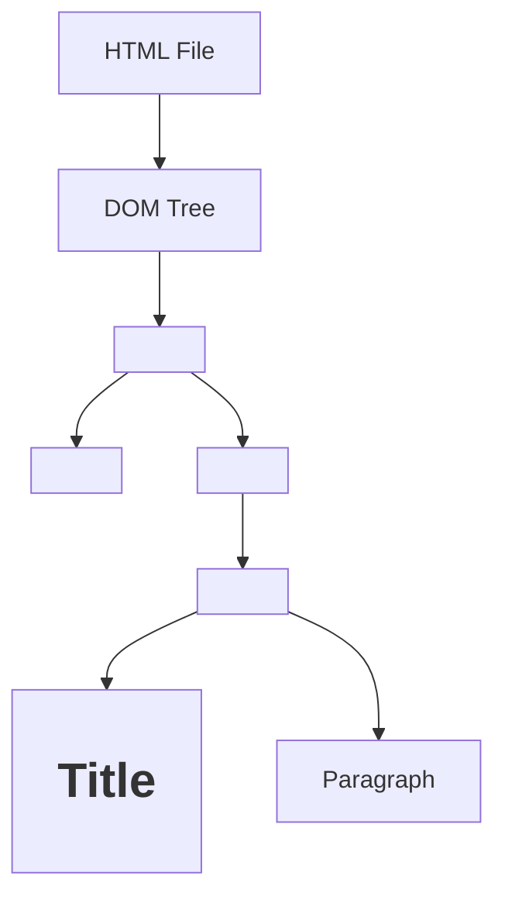

# 🚀 React JS Learning Notes  
**By Rishabh Umredkar**

---
## 📑 Index


### Day 1: Getting Started with React
1. [Getting Started with React](#-day-1-getting-started-with-react)
    1.1. [Why Use React?](#-why-use-react)
2. [JavaScript Modules: Export & Import](#-javascript-modules-export--import)
    2.1. [Basic Export & Import](#-basic-export--import)
    2.2. [Scenario 1: Exporting & Importing Functions](#-scenario-1-exporting--importing-functions)
    2.3. [Scenario 2: Exporting Multiple Values](#-scenario-2-exporting-multiple-values)
   - [2.3.1. Exporting Multiple Values as an Array](#-21-exporting-multiple-values-as-an-array)
   - [2.3.2. Exporting Multiple Values as an Object](#-22-exporting-multiple-values-as-an-object)
3. [Summary](#-summary)
4. [Interview Tip](#-interview-tip)

### Day 3: React Concepts & Q&A
5. [React Concepts & Q&A](#-day-3-react-concepts--qa)
    5.1. [Q1. Advantages and Disadvantages of React](#-q1-what-are-the-advantages-and-disadvantages-of-react)
    5.2. [Q2. SPA vs MPA](#-q2-difference-between-single-page-application-spa-and-multiple-page-application-mpa)
    5.3. [History of Popular Frontend Frameworks](#-history-of-popular-frontend-frameworks)
    5.4. [Q3. What is the Diffing Algorithm?](#-q3-what-is-the-diffing-algorithm)
    5.5. [Q4. What is Reconciliation?](#-q4-what-is-reconciliation)
    5.6. [Q5. What is React Fiber?](#-q5-what-is-react-fiber)
    5.7. [Real DOM Diagram](#-real-dom-diagram)


---

## 📅 Day 1: Getting Started with React

### 🌟 Why Use React?

React is a powerful JavaScript library for building **user interfaces**, especially **Single Page Applications (SPAs)**. In SPAs, the entire app runs on a single HTML page, updating content dynamically **without reloading**—making your apps fast and seamless!

> **Famous SPAs:**  
> Instagram • Facebook • GitHub

---

## 📦 JavaScript Modules: Export & Import

JavaScript modules help you organize your code by splitting it into separate files. You can **export** variables, functions, or objects from one file and **import** them into another.

---

### ✨ Basic Export & Import

**Exporting a value:**

```js
// India.js
let phone = "IPhone";
export default phone;
```

**Importing the value:**

```js
import phone from "./India.js";
console.log(phone); // Output: IPhone
```

---

### 🛠️ Scenario 1: Exporting & Importing Functions

- With `export default`, you can export a function and import it using **any name**.

**Exporting a function:**

```js
// India.js
let phone = () => {
    console.log("IPhone");
};
export default phone;
```

**Importing with a different name:**

```js
import Lava from "./India.js";
Lava(); // Output: IPhone
```

---

### 🧩 Scenario 2: Exporting Multiple Values

You **can't** export multiple values directly with `export default`.  
Instead, group them in an **array** or **object**.

#### 2.1. Exporting Multiple Values as an Array

**Exporting:**

```js
// India.js
let phone = () => {
    console.log("IPhone");
};
let Laptop = "AsusX515";
export default [phone, Laptop];
```

**Importing:**

```js
import Resourse from "./India.js";
let [phone, Laptop] = Resourse;
console.log(Laptop); // Output: AsusX515
phone(); // Output: IPhone
```

#### 2.2. Exporting Multiple Values as an Object

**Exporting:**

```js
// India.js
let resourse1 = "Weapons";
let resourse2 = "Crude Oil";

let obj = {
    resourse1,
    resourse2,
    func: () => {
        console.log("Function");
    }
};
export default obj;
```

**Importing:**

```js
import India_Resourse from "./India.js";
let { resourse1, resourse2, func } = India_Resourse;
console.log(resourse2); // Output: Crude Oil
func(); // Output: Function
```

---

## 📝 Summary

- Use **`export default`** to export a single value (variable, function, array, or object).
- Import a default export with **any name**.
- To export multiple values, **group them** in an array or object.
- Use **destructuring** to access individual values after importing.

> 💡 **Interview Tip:**  
> "Use `export default` to export a single value (variable, function, array, or object) from a JavaScript module, and import it with any name in another file."

---
## 📅 Day 3: React Concepts & Q&A

### ❓ Q1. What are the Advantages and Disadvantages of React?

**Advantages:**
1. **Fast & Smooth Apps:** React uses a Virtual DOM, which updates only the parts of the UI that change. This makes apps highly responsive and efficient.
2. **Component Reusability:** You can build small, reusable components and combine them to create complex UIs, reducing code duplication.
2. **Code Reusability:** Encourages reuse of components, reducing redundancy.
3. **Rapid Development:** Component-based structure accelerates development.
4. **Easy Maintenance:** Modular code simplifies updates and maintenance.
5. **Lightweight Applications:** Efficient rendering keeps apps lightweight.

**Disadvantages:**
1. **SEO Limitations:** SPAs have limited SEO because only one HTML file is loaded, restricting meta tag updates.
2. **Higher Cost:** Requires skilled developers, potentially increasing project costs.

---

### ❓ Q2. Difference Between Single Page Application (SPA) and Multiple Page Application (MPA)

| Feature                | SPA (Single Page Application)                  | MPA (Multiple Page Application)             |
|------------------------|-----------------------------------------------|---------------------------------------------|
| **Page Loading**       | Loads a single HTML file; updates content dynamically | Loads a new HTML file for each page         |
| **Speed**              | Faster navigation after initial load           | Slower navigation due to full page reloads  |
| **SEO**                | Limited SEO support                           | Better SEO, as each page can have unique meta tags |
| **User Experience**    | Smooth, app-like experience                   | Traditional website feel                    |
| **Development**        | More complex routing, but easier state management | Simpler routing, but more code duplication  |

---

### 🏛️ History of Popular Frontend Frameworks

- **Angular (2009, Google):**  
    - Based on MVC architecture  
    - Supports JavaScript & TypeScript

- **React (2011, Facebook):**  
    - Component-based architecture  
    - Supports JavaScript & TypeScript  
    - Used by Instagram (2011), Facebook (2012), Officially launched (2013)

- **Vue (2014, Evan You):**  
    - Component-based architecture  
    - Supports JavaScript & TypeScript

- **Angular 2 (2016, Google):**  
    - Component-based architecture  
    - Supports only TypeScript

---

### ❓ Q3. What is the Diffing Algorithm?

The **diffing algorithm** is React's process for comparing the current Virtual DOM with the previous one to identify changes. It efficiently finds the differences between the Virtual DOM and the Real DOM, minimizing updates and improving performance.

It is the process of finding the Difference between Real DOM And Virtual DOM.


---

### ❓ Q4. What is Reconciliation?

**Reconciliation** is the process where React applies the changes found by the diffing algorithm to the Real DOM. This ensures only the necessary updates are made, making the UI fast and efficient.

Implementing the changes in Real DOM, that found during the Diffing Algorithm Virtual DOM.

---
### ❓ Q5. What is React Fiber?

**React Fiber** is the core engine of React responsible for handling its internal processes, such as the diffing algorithm, reconciliation, and rendering updates. It enables React to efficiently manage complex UI updates, prioritize tasks, and deliver smoother user experiences by breaking rendering work into smaller units.

---

### 🖼️ Real DOM Diagram



**Explanation:**  
- The Real DOM is a tree-like structure representing the HTML elements of a page.
- Each HTML tag becomes a node in the DOM tree.
- React interacts with the Real DOM by updating only the parts that change, thanks to the Virtual DOM and reconciliation process.

---
